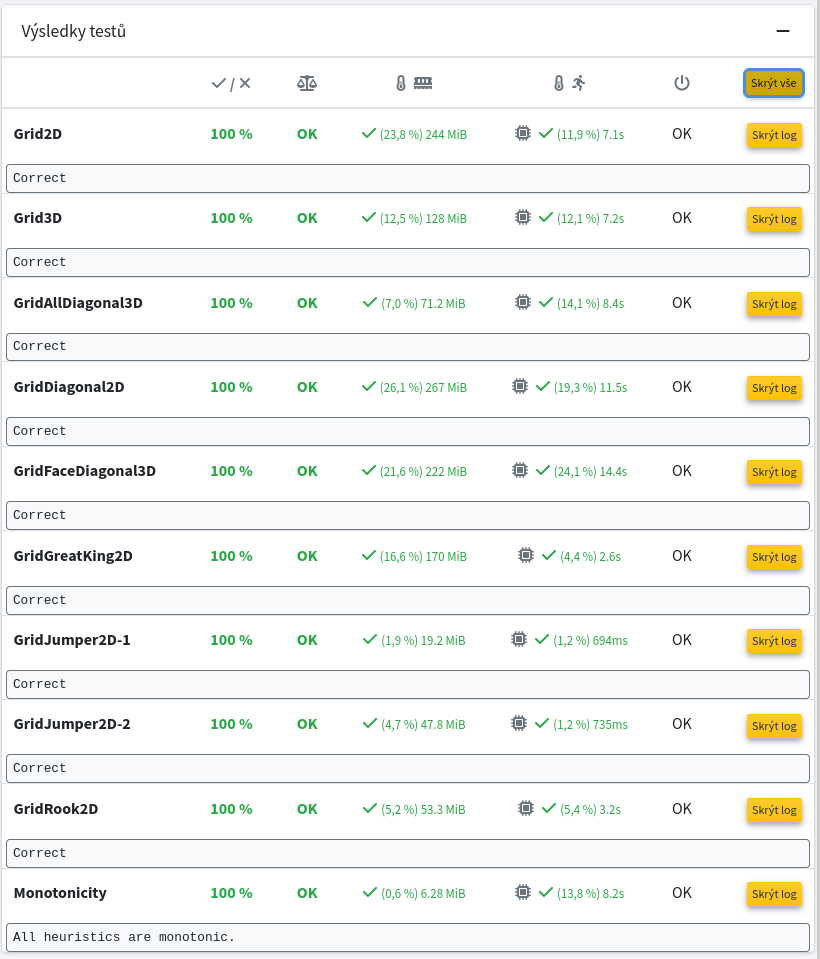

Implement monotone heuristics for the A* algorithm running on subgraphs of the following infinite grids.

* Grid2D: The classic two-dimensional grid
* Grid3D: The classic three-dimensional grid
* GridDiagonal2D: The two-dimensional grid that includes diagonals (including {(0,0), (1,1)} and {(0,1), (1,0)})
* GridAllDiagonal3D: The three-dimensional grid containing both face and space diagonals (including, for example, {(0,0,0), (1,1,0)} and {(0,0,0), (1,1,1)})
* GridFaceDiagonal3D: The three-dimensional grid containing face diagonals but not space ones (for example, it contains {(0,0,0), (1,1,0)} but does not contain {(0,0,0), (1,1,1)} )
* GridRook2D: Edges correspond exactly to the movement of the rook on the chessboard where the movement distance is limited to 8 cells (for example, it contains {(0,0), (0,8)} and {(0,0), (-8,0)} but it does not include {(0,0), (9,0)})
* GridGreatKing2D: The Great King can move up to 8 cells in each coordinate (for example, the grid contains {(0,0), (8,8)} and {(0,0), (-5,4)} but it does not include {(0,0), (9,0)})
* GridJumper2D: The movement are similar to the knight: it moves exactly 3 cells in one coordinate and 2 cells in the other one, so the graph is 8-regular (for example, it contains {(0,0), (2,-3)} and {(0,0), (3,-2)} but it does not include {(0,0), (1,0)}, {(0,0), (4,1)}, {(0,0), (2,2)})

A subgraph is given by an oracle that decides whether an edge of the grid is presented or removed from the subgraph.

Download the git repository https://gitlab.mff.cuni.cz/finkj1am/introai.git and implement all functions in heuristics.py. Submit only the heuristics.py file to ReCodex. Please, do not change the name of the file when submitting. You can also edit other files while debugging, but keep in mind that recodex will not take these changes into account.

Recodex tests are the same as in the file informed_search_tests.py. The expected heuristics visit at most one million vertices in each test, and inefficient heuristics fail to find a shortest path within time or memory limits set in ReCodex. Time limit on Recodex is 60 seconds for each grid. Memory limit is 1GB.

File monotonicity_tests.py contains tests verifying monotonicity of your heuristics. These tests are evaluated by 0 points on recodex, so their passing is voluntary. Nevertheless, they may be helpful to fulfill this assignment.

Hints:
* Observation: If an integer is larger than 5.5, then it is at least 6.
* The command "ulimit -v" may be useful to limit amount of memory the program can allocate to prevent swapping and other problems related to insufficient amount of memory.

