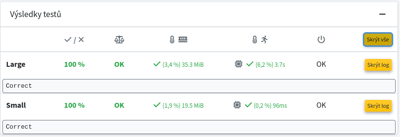

Total coloring (see e.g. https://en.wikipedia.org/wiki/Total_coloring) of a graph is the coloring of vertices and edges such that
* vertices connected by an edge have different colors,
* edges sharing a common vertex have different colors and
* edges and their end-vertices have different colors.
The total chromatic number of a graph is the minimum number of colors required for total coloring of the graph. Write a program which finds the total chromatic number using the Constraint satisfaction problems. Implement function total_coloring in the file total_csp.py upload only this file to ReCodex.

This task can be solved using many methods (e.g. SAT, Linear Programming and backtracking), but the goal of this assignment is to practice using constraint satisfaction programming solvers on a simple problem. Therefore, you are expected to used the library **python-constraint** (https://pypi.org/project/python-constraint/). Do not install constraint or any other library with a similar name. A graph is given using the library networkx (https://pypi.org/project/networkx/), so a part of the assignment is reading the documentation of mentioned libraries.

You are expected to write a program which is able to find the total coloring for an arbitrary graph; although, your program is tested on few graphs only. Therefore, it is forbidden to precompute any results which works for tested graphs only.

Hints:
* Read basic information about total coloring: https://en.wikipedia.org/wiki/Total_coloring
* Read documentation of used CSP solver: https://pypi.org/project/python-constraint/
* Read examples of using CSP solver: https://github.com/python-constraint/python-constraint/tree/master/examples

Time limit on Recodex is 60 seconds for each test (i.e. a collection of graphs). Memory limit is 1GB.

