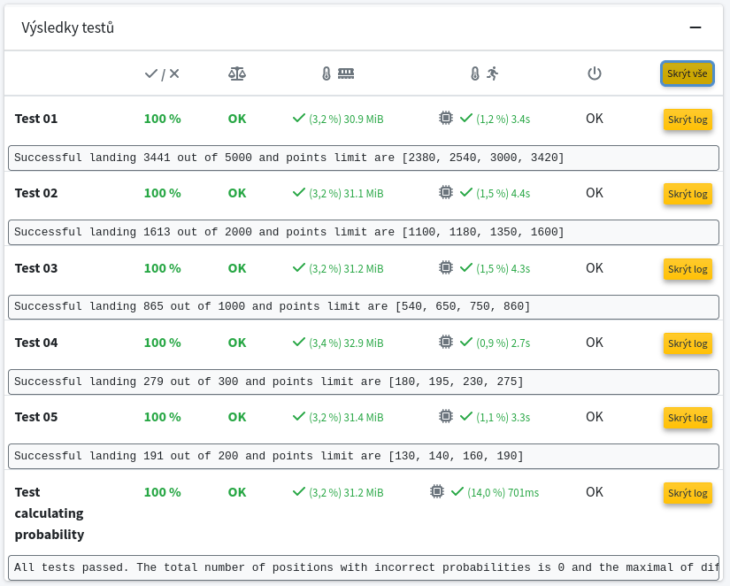

After the shutdown of space stations Mir and ISS, people started colonizing the Mars.
The first station is already built but it is not self-sustainable yet, so it requires regular shipments of supplies.
Since navigation of rockets to Mars does not work properly, rockets land (crash to be more precise) somewhere in the vicinity of the station
and supplies need to be carried by an autonomous robot from the crash site to the station.
Our task is to write a program that drives the robot.

For simplicity of the task, the vicinity of the station is split into cells forming a two-dimensional grid bounded by a rectangle (called a map).
Finding the shortest path in the two-dimension grid would be simple but there are few major problems.

1. The robot has no idea about its location. 
By experience, the probabilistic distribution of crash sites is known to be uniform on the map (for simplicity).
The position of the station is marked on the map and the robot has to reach it autonomously.

1. Most robot's sensors are damaged and only a trivial binary sensor remains operational.
The robot's map contains geological data about every position, so the robot can calculate average color and convert into the grayscale.
The binary sensor reads a random binary value based on this grayscale; i.e., the grayscale of every position is the probability that the sensor reads the true value.
After every move, the robot receive one sensor reading and these random variables are assumed to be independent.

1. The robot accepts commands NORTH, SOUTH, WEST, and EAST which move the robot by one cell in the given direction.
However, the map is bounded by a rectangle.
When the robot leaves the map, it is lost.
Furthermore, the robot has a battery of limited capacity, so after a given number of steps, the robot is also lost.

Luckily, the robot's movement system works perfectly, so the position relative to the crash site can be easily determined.

Our task is to write a program maximizing the number of robots successfully reaching the station.
File robot_control.py contains a trivial control algorithm and your task is to improve it.
You can modify this file as you like but keep the interface used by file robot_test.py.
Only the file [robot_control.py] is expected to be submitted.

You can use and combine every knowledge from our course, i.e. informed search, logic, and probabilistic reasoning.
Especially, chapters 15.1.-15.3. from the book Artificial Intelligence: A modern approach (3rd edition) could be useful.
However, you are expected to explain your approach, so write comments in your code.
Teachers will reduce the number of points for unclear code.

Hints:
* Grayscale is given as a matrix which also determines the coordination system and the rectangle where the robot can operate.
Therefore, going south increases the row index, and going east increases the column index.

* Every test contains multiple landings.
You should be able to obtain two points from every test and you can try to get the third point if your are interested.

* The reference time provided by the script informed_search_tests.py is the running time on computer Intel(R) Core(TM) i5-7200U CPU @ 2.50GHz with 8 GB RAM. 
Time limit on Recodex is 5 minutes for each test and an evaluation of the reference solution on recodex is below.

* You can use numpy and scipy packages to solve the task.

* You should be able to exactly determine the probability distribution of the current location of the robot after every step.
The script probability_test.py contains some tests for checking your calculation of this distribution.
These tests are evaluated by 0 points on recodex, so their passing is voluntary. Nevertheless, they may be helpful to fulfill this assignment.

* There are two ways a robot may fail: it falls out of the map or it runs out energy.
When minimizing failures, try to balance those two reasons.
Notice that longer the robot moves on Mars, more sensor readings it receives, so more accurate the knowledge of position is.
On the other hand, the number of steps is limited.

* Notice that determining the probability distribution of the current location is only a (very) useful information.
But the primal goal is to reach the base.
So, you may consider the probability that a step in a given direction moves the robot closer to the base or the probability that the robot moves out of the map.

* Try to imagine yourself being transported into an unknown position.
What would be your initial actions?

* You should be able to receive 10 points from this assignment.
Remaining points are considered as challenge for students who see many opportunities for saving more robots.
There are many ways how to use this distribution to control the robot. 
The lecture provides a very simple strategy and you can improve it using your creativity. Good luck.

