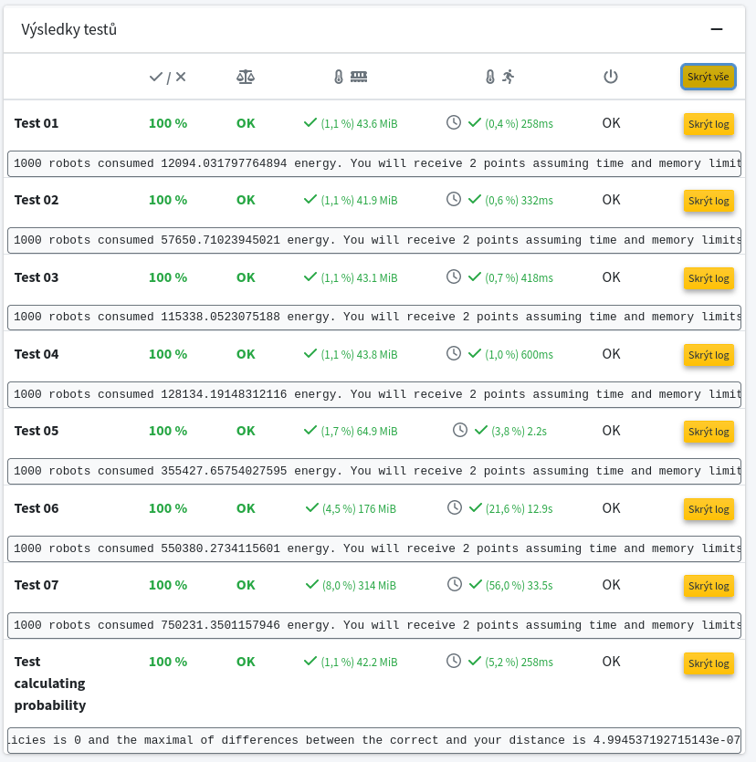

After the shutdown of space stations Mir and ISS, people started colonizing the Mars.
The first station is already built but it is not self-sustainable yet, so it requires regular shipments of supplies.
Since navigation of rockets to Mars is not working properly, rockets land (crash to be more precise) somewhere in the vicinity of the station
and supplies need to be carried by an autonomous robot from the crash site to the station.
Our task is to write a program that drives the robot.

For simplicity of the task, the vicinity of the station is split into cells forming a two-dimensional grid.
Finding the shortest path in the two-dimension grid would be simple but there are two major problems.

1. The robot accepts commands NORTH, SOUTH, WEST, and EAST which move the robot by one cell in the given direction.
However, unsuccessful landing caused some damage to the robot's engines so its movement is imperfect.
After initial diagnosis, the robot estimates probabilities p_forward, p_backward, p_left, and p_right (summing up to one) which give the distribution of actual movement relative to the given direction.
For example; when the command is EAST, then the robot moves to the east with probability p_forward, south with probability p_right, west with probability p_backward, and north with probability p_left.

2. The environment of Mars is dangerous and there are many obstacles.
During previous explorations, the amount of energy needed to travel from a cell A to an adjacent cell B was estimated.
The robot has a map which contains the position of the base and a matrix M determining the amount of energy to reach every cell.
Therefore, the amount of energy needed to travel from a cell A to an adjacent cell B is M[B].

3. The explored area is surrounded by high mountains, so any attempt to move from a position (1,i) to (0,i) results to consuming M[(0,i)] while remaining at position (1,i).
Similarly, all positions in the first and last rows and columns are unreachable.

Luckily, the robot's location system works perfectly, so the robot knows its position after every landing and movement.

Our task is to write a program minimizing the total amount of energy for robots to reach the station since the station needs a lot of energy.
File robot_control.py contains a trivial control algorithm and your task is to improve it.
You can modify this file as you like but keep the interface used by file robot_test.py.
Only the file robot_control.py is expected to be submitted.

You can use and combine every knowledge from our course, i.e. informed search, logic, and probabilistic reasoning.
Especially, chapters 17.2 and 17.3 from the book Artificial Intelligence: A modern approach (3rd edition) could be useful.
However, you are expected to explain your approach, so write comments in your code.
Teachers will reduce the number of points for unclear code.

Hints:
* The energy matrix also determines the coordination system.
Therefore, going south increases the row index, and going east increases the column index.
Note that the robot cannot move outside the matrix since any attempt to reach the first or the last row or column fails and only consume energy.
See the function single_landing for more details.

* Every test contains multiple landings in the vicinity of one station, so the energy consumptions are unchanged.
It may be surprising that the distribution of actual movements (p_forward, p_backward, p_left, and p_right) is the same after every landing.
Therefore, it is recommended to precompute commands for every cell in the initialization of each test to make your program reasonably fast.

* Mathematically speaking, the problem is stationary, i.e. the expected energy needed to reach the station from a given cell does not depend on the past (where it landed or how the cell was reached assuming the cell was successfully reached).
Therefore, it is recommended to calculate the minimal expected energy needed to reach the station from every cell (which can be considered as the expected distance from a cell to the station) and the best policy (direction) for every cell. 
The calculation of these distances and policies is tested by the script probability_test.py.
These tests are evaluated by 0 points on recodex, so their passing is voluntary.
Nevertheless, they may be helpful to fulfill this assignment.

* It may be easier to first implement value update but this method usually leads to 8 points since it is too slow.
To make the computation faster, implement the policy update.

* Python package scipy may be useful to solve the task.
Especially, [a sparse matrix](https://docs.scipy.org/doc/scipy/reference/generated/scipy.sparse.csc_matrix.html) and [a linear system solver](https://docs.scipy.org/doc/scipy/reference/generated/scipy.sparse.linalg.spsolve.html) may be handy.

